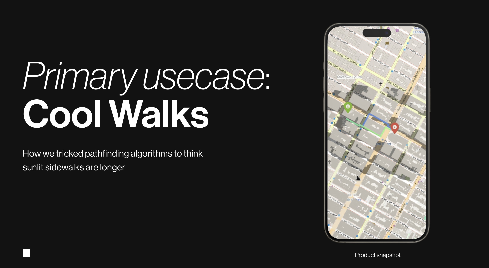
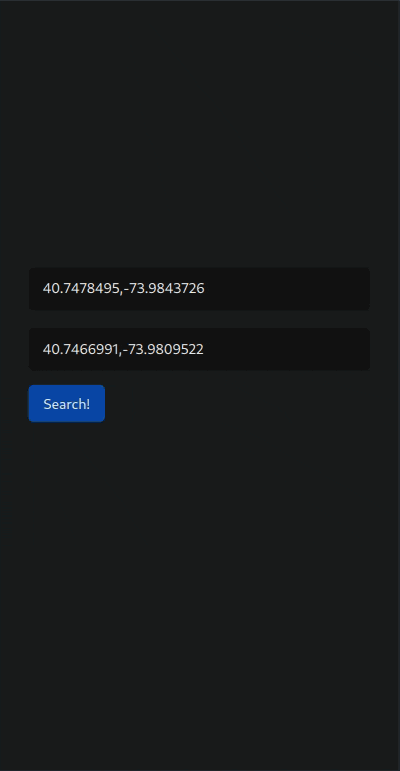
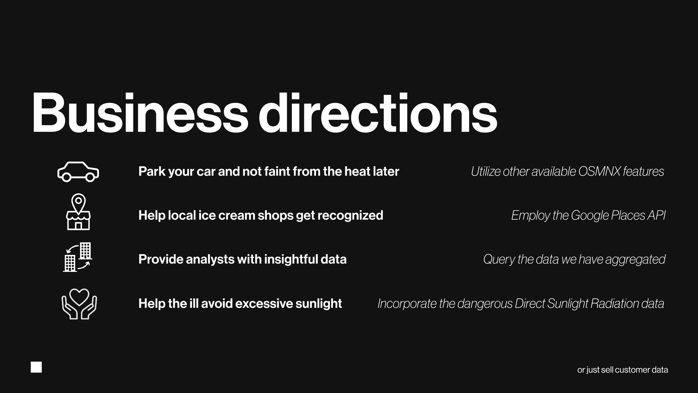

From 21 June to 23 June 2024 at [Hack4ChangeTECH](https://hack4change.tech/) we created 
a tool to compute and aggregate shadow data from everywhere and anytime. We won the contest in 2 out of 3 categories: of the best project created during the Hackathon, as well as the public's favorite.



The primary usecase of our tool was a working program that finds the walking path between two given points, which is both the shortest and has the least amount of sun exposure. 
<!--  -->
<center>

</center>

By modifying the edges in the road network to incorporate sunlight exposure the existing pathfinding algorithms returned a path in shade visualized above.




After experimenting with other APIs and data sources we also recognized some further business applications, which would require a reasonable amount of work to generate actual value to our potential customers.

# Technical notes

## Development setup

Project dependencies might be installed using [PDM](https://pdm-project.org/en/latest/)
Refer to PDM documentation for:
- [PDM Installation](https://pdm-project.org/en/latest/#installation) 
- [Managing Dependencies](https://pdm-project.org/en/latest/usage/dependency/#manage-dependencies)

TLDR; install PDM then use the command `pdm sync` to install all dependencies.

Also: `pip install -r requirements.txt`


### Running the app
##### Frontend Build
Go to the `frontend` directory and run the following command:
```bash
npm run build
```

##### Server & Backend
To serve the frontend and API, execute the following command:

```bash
fastapi dev api.py
```

before executing the command make sure that all dependencies are installed
